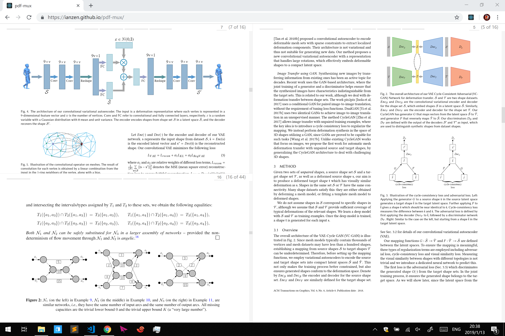

# PDF-MUX. 

In browser example.

 

## A minimal PDF reader with split screen views.
Inspired by tmux and built using cross-platform web technology,
this project aims to make make your document content be at the
forefront. 

 

## Try in Browser.
http://ianzen.github.io/pdf-mux

 

## Dev Installation.
### Feel free to tinker with source code.

Install dependencies
`yarn install` 
Run in browerser
`yarn run start` 
Build executable
`yarn run electron-pack` 

More scripts found in `package.json` file

 

## Work In Progress.
This is an early concept prototype. More features and optimizations will be added. 
- [x] Fix page height scaling
- [ ] Render page view **after** drag finished
- [x] Page number counter
- [x] Jump to page
- [x] Split page to current
- [ ] Layout saving 
- [ ] Sidebar 
- [x] Link jump (forward + backward)
- [x] Session saving

